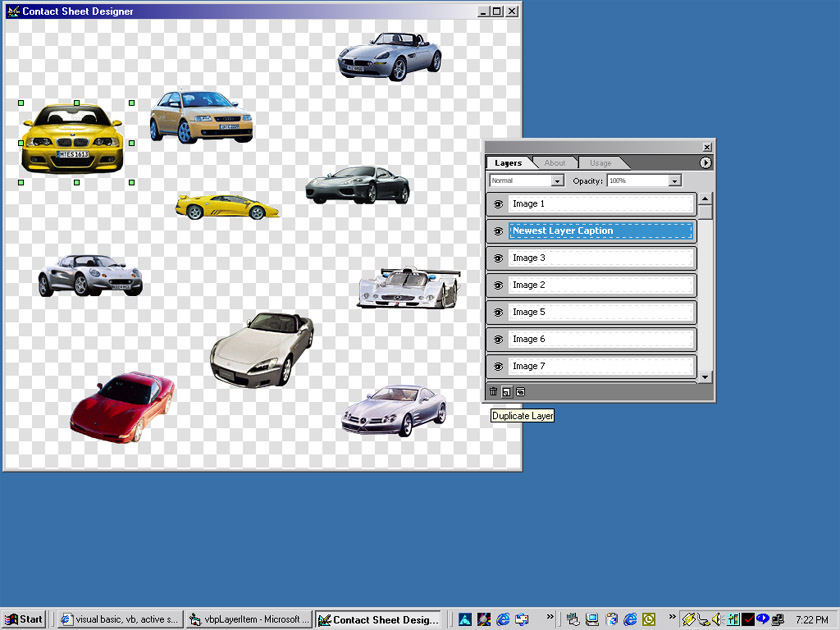



## VBLayer Manager Open Source

### Description

I have decided to open source this for everyone to look at. if you use it in your apps please give me credit. it emulates a photoshop layer window and shows how to create a drag/drop/resizing designer form. There were numerous problems with original postings and i apologize for the wasted time. there seems to be some type of dependency issues, so if you still cant get this to run, leave a comment. as I am still in the process of developing this ,if anyone makes updates to this, i would appreciate it if they sent the file to me rather than post it here so i can incorporate the chnages, fixes into my master code that i will post when everything (everything) is complete. Eventually , there will be built in effects and filters and a whole lot more crazy stuff. anyway vote if you like it. BTW, this is not to illustrate image processing at all, it is a demonstration of controlling objects from User Controls. The example app is merely used to show the control in action.  thanks Ray

p.s. dont forget to regsvr32 the ssubtmr.dll first

              |
---                |---
**Submitted On**   |2001-02-10 11:41:14
**By**             |[Ray Hildenbrand](https://github.com/Planet-Source-Code/PSCIndex/blob/master/ByAuthor/ray-hildenbrand.md)
**Level**          |Advanced
**User Rating**    |4.7 (85 globes from 18 users)
**Compatibility**  |VB 4\.0 \(32\-bit\), VB 5\.0, VB 6\.0
**Category**       |[OLE/ COM/ DCOM/ Active\-X](https://github.com/Planet-Source-Code/PSCIndex/blob/master/ByCategory/ole-com-dcom-active-x__1-29.md)
**World**          |[Visual Basic](https://github.com/Planet-Source-Code/PSCIndex/blob/master/ByWorld/visual-basic.md)
**Archive File**   |[CODE\_UPLOAD147732102001\.zip](https://github.com/Planet-Source-Code/ray-hildenbrand-vblayer-manager-open-source__1-15182/archive/master.zip)

